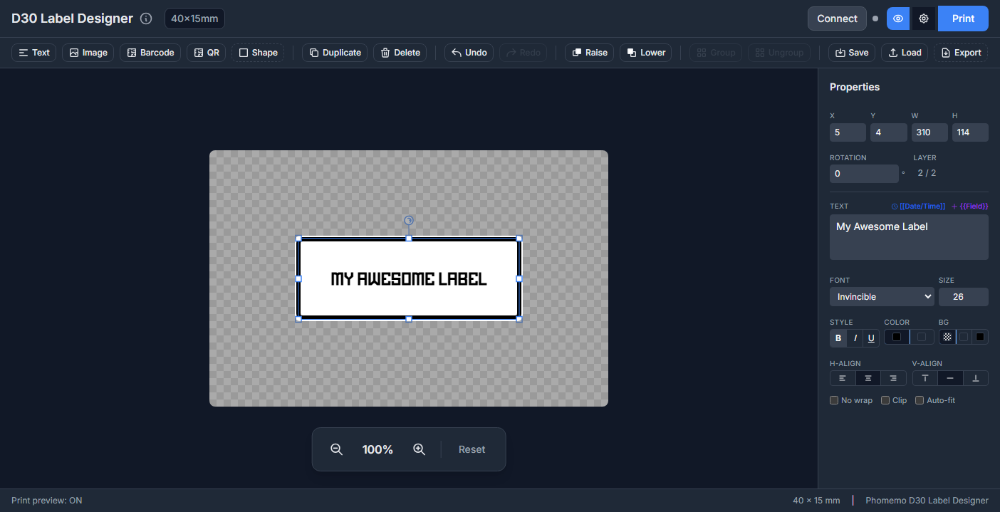

# D30 Label Designer

A browser-based label designer for the **Phomemo D30** thermal label printer, built for Linux. Connects to the printer via Bluetooth (Web Bluetooth API) — no drivers or native app required.

**Live app:** https://spicylimes.github.io/Thermal-Printer-UI/

## Requirements

- A Chromium-based browser (Chrome, Chromium, Edge) — Web Bluetooth is not supported in Firefox or Safari
- HTTPS or `localhost` context (the live GitHub Pages URL satisfies this)
- Phomemo D30 printer with Bluetooth enabled

## Quick Start

1. Open the [live app](https://spicylimes.github.io/Thermal-Printer-UI/) in Chromium
2. Turn on your D30 and make sure Bluetooth is enabled on your machine
3. Click **Connect** and select your printer from the device picker
4. Design your label, then click **Print**

## Running Locally

Web Bluetooth requires a secure context. The easiest way to run locally:

```bash
cd /path/to/repo
python3 -m http.server 8080
```

Then open `http://localhost:8080` in Chromium.

## Current Build Restrictions

This build is locked to a **single label size: 40×15mm**. No other sizes are selectable.

**Why:** The D30 firmware enforces a hard limit of 12 bytes (96 dots) per raster row in the `GS v 0` print command. A 40×15mm label after the required 90° rotation produces rows that are 15 bytes (120 dots) wide. The working solution crops the rotated raster to 12 bytes per row before sending. Content must be positioned within the printable 96-dot (12mm) height to avoid being cropped.

**Label sizes not yet supported:** 12×40mm, 12×50mm, 14×40mm, 15×50mm. These require further protocol work to support correctly.

## Features

- **Elements** — Text, images, barcodes (Code128/EAN/UPC), QR codes, shapes
- **Editing** — Drag/resize/rotate, multi-select, group/ungroup, undo/redo
- **Templates** — Variable fields (`{{Name}}`) with CSV batch printing
- **Instant expressions** — Dynamic values like `[[date]]`, `[[time]]` resolved at print time
- **Export** — Save/load designs as JSON, export PNG or PDF
- **Print preview** — Dither preview shows exact thermal output before printing
- **Mobile UI** — Full touch support on screens < 768px

## Keyboard Shortcuts

| Shortcut | Action |
|----------|--------|
| `Ctrl+Z` | Undo |
| `Ctrl+Shift+Z` | Redo |
| `Ctrl+D` | Duplicate selected |
| `Ctrl+G` | Group selected |
| `Ctrl+Shift+G` | Ungroup |
| `Delete` | Delete selected |
| `Arrow keys` | Nudge 1px |
| `Shift+Arrow` | Nudge 10px |
| `Shift+Click` | Add to selection |

## Project Structure

```
├── index.html      # Main UI
├── app.js          # Application logic
├── canvas.js       # Canvas rendering & raster conversion
├── elements.js     # Element management
├── handles.js      # Selection handles
├── ble.js          # Web Bluetooth transport
├── printer.js      # D-series print protocol
├── constants.js    # Shared constants & label sizes
├── storage.js      # localStorage persistence
├── templates.js    # Variable/expression substitution
├── assets/         # Favicons and web manifest
└── utils/
    ├── bindings.js     # Event binding helpers
    ├── errors.js       # Error handling
    └── validation.js   # Input validation
```

## Based On

This project is a modified version of **Phomymo** by [transcriptionstream](https://github.com/transcriptionstream/phomymo), narrowed to D-series printers only with a dark UI and Linux-focused workflow. Used with acknowledgement.

## License

MIT
